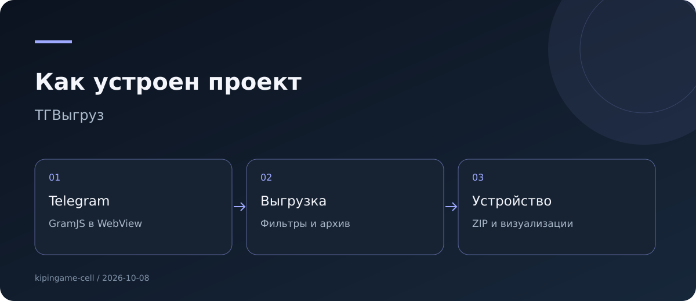

# ТГВыгруз


**Выгрузка Telegram прямо на Android**

Android-приложение выгрузки и анализа Telegram-чатов: GramJS работает в WebView, отдельный Node-сервер для основной выгрузки не нужен.

**Тип:** Android · Telegram · **Версия:** 1.0.0 · **Документация сверена:** 2026-10-08.

[Версии и скачивание](docs/RELEASES.md) · [Аудит и предложения](docs/AUDIT.md) · [Исходники](https://github.com/kipingame-cell/tg-matrix-apk) · [Сборки](https://github.com/kipingame-cell/tg-matrix-apk/actions)

## Возможности

- Вход по номеру телефона, коду и паролю 2FA.
- Фильтры по датам, участнику, ключевым словам, типу сообщений и медиа.
- Экспорт ZIP с текстом, JSON, графом связей и данными активности.
- Локальный журнал выгрузок, граф связей и радар активности.
- Опциональные отправка архивов ботом и ИИ-досье через внешние API.

## Запуск и проверка

```bash
npm install
npm run build
npx cap add android
node apply-signing.js
npx cap sync android
```

## Устройство



Основные файлы и каталоги: `src/app.js · build.js · www/ · apply-signing.js`.

## Проверенное состояние

Последняя исходная APK-сборка GitHub Actions успешна. Автоматических функциональных тестов в репозитории нет; вход в Telegram и реальная выгрузка здесь не выполнялись.

## Дальнейшие улучшения

- Добавить тесты фильтрации сообщений, отмены и восстановления выгрузки.
- Показать размер архива до скачивания медиа и статус ограничений Telegram.
- Прямо объяснять, какие данные отправляются внешнему ИИ и боту.

Полный список обнаруженных проблем: [AUDIT.md](docs/AUDIT.md).

Подробные материалы первоначальной редакции: [архив README](docs/README-previous.md).
